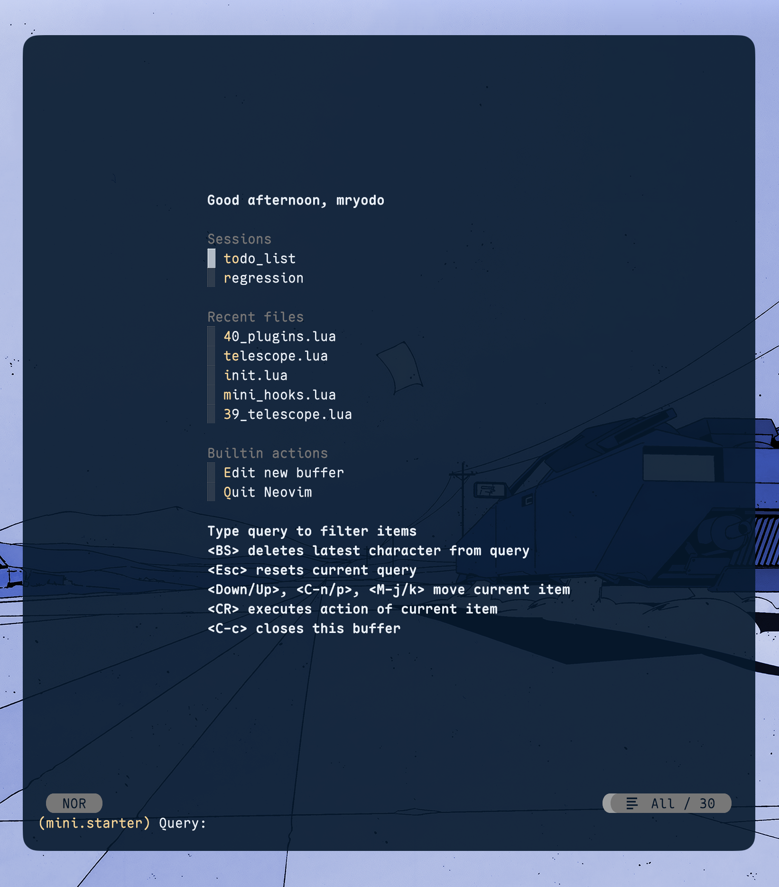
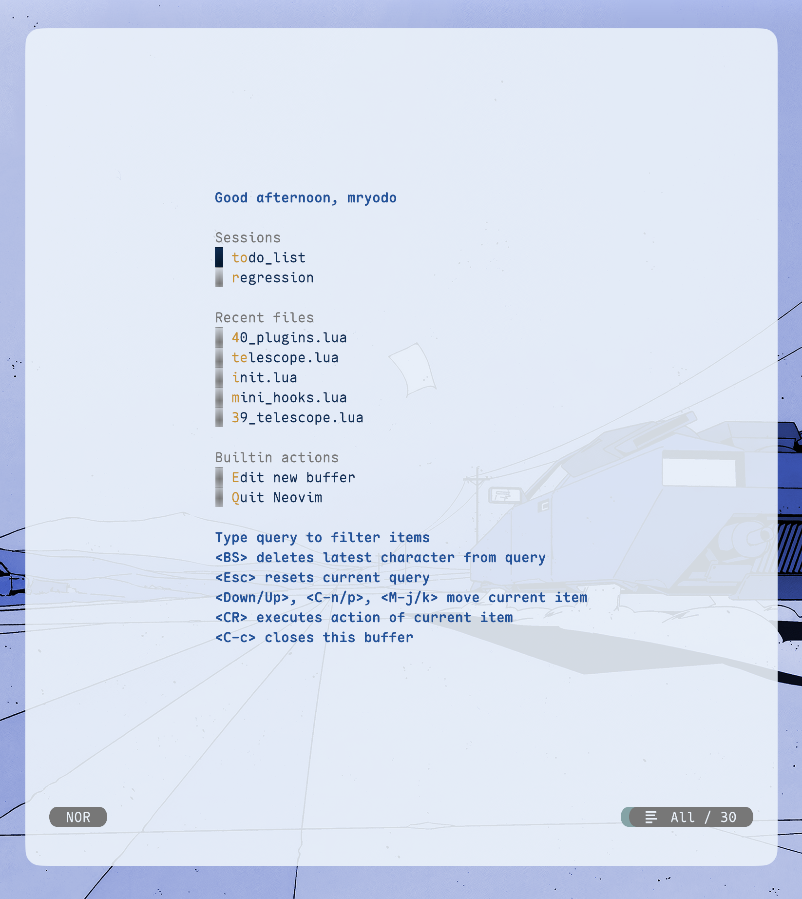

<div align="center">
  <h1>RWTH.nvim</h1>
  <p>Based on stellar <a href="https://github.com/oskarnurm/koda.nvim">Koda.nvim</a> using official <a href = "https://github.com/ifs-rwth-aachen/RWTH-Colors" >RWTH colors</a> </p>
    <p>A minimalist(-ish) theme for <a href="https://github.com/neovim/neovim">Neovim</a>, written in Lua</p>
</div>

|            | Dark Theme                                                                                                          | Light Theme                                                                                                          |
| ---------- | ------------------------------------------------------------------------------------------------------------------- | -------------------------------------------------------------------------------------------------------------------- |
| **Syntax** |  |  |

<details>
<summary>mini-start</summary>

|              | Dark Theme                                      | Light Theme                                       |
| ------------ | ----------------------------------------------- | ------------------------------------------------- |
| `mini-start` |  |  |

</details>

<details><summary>mini-files</summary>

|              | Dark Theme                                                                                                         | Light Theme                                                                                                         |
| ------------ | ------------------------------------------------------------------------------------------------------------------ | ------------------------------------------------------------------------------------------------------------------- |
| `mini-files` |  |  |

</details>

<details><summary>telescope</summary>

|             | Dark Theme                                                                                                             | Light Theme                                                                                                             |
| ----------- | ---------------------------------------------------------------------------------------------------------------------- | ----------------------------------------------------------------------------------------------------------------------- |
| `telescope` |  |  |

</details>

<details><summary>Active Pmenu</summary>

|                    | Dark Theme                                                                                                              | Light Theme                                                                                                              |
| ------------------ | ----------------------------------------------------------------------------------------------------------------------- | ------------------------------------------------------------------------------------------------------------------------ |
| **Active `Pmenu`** |  |  |

</details>

## Installation

Using `vim.pack`:

```lua
  vim.pack.add({ src =  "https://github.com/mryodo/rwth.nvim" })
  require("rwth").setup({
    transparent = false
  })
  vim.cmd("colorscheme rwth-dark")
```

**Bug fix**: if you encounter not loaded artifacts in `Pmenu` and statusline, add

```lua
later(function()
  vim.cmd("colorscheme rwth-dark")
end)
```

to reload the colorscheme again.
